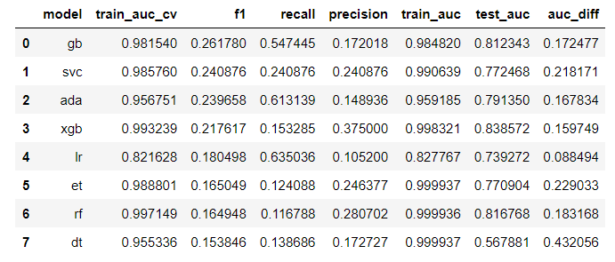

# Project 4: West Nile Virus
**Members**: DJ  | Nazira  |  Sean  |  Shuyi

# Problem Statement

West Nile virus (WNV), a mosquito-borne zoonotic disease, was first identified in the United States in the summer of 1999 in New York City. The first major WNV outbreak in the United States was observed in 2002, when more than 4,150 human cases and 284 deaths attributable to WNV infection from 40 states were reported to the CDC. This stirred a prompt public health response from federal, state, and local public health agencies and led to the establishment of a more robust surveillance of mosquitoes and birds to monitor and control the spread of WNV. In Illinois, WNV human infections have been endemic since 2002, with annual variability in the number of cases. The majority of the human WNV cases have been reported from the northeastern region, where the largest number of people in the state is congregated.([Research article](https://journals.plos.org/plosone/article?id=10.1371/journal.pone.0227160))

We are looking to improve the cost-effectiveness of existing strategies in tackling adult mosquito populations and mitigating the spread of the West Nile Virus (WMV)by building a machine learning algorithm to predict the presence of the West Nile Virus, using data on past weather conditions and locations where the WMV was detected.

Our tool can be employed to effectively carry out targeted spraying of specific at-risk neighbourhoods. This will ultimately help the City of Chicago save costs and better re-allocate resources in its task to prevent / mitigate the spread of the WMV.

# Data 

We were tasked to used the datasets from ([Kaggle](https://www.kaggle.com/c/predict-west-nile-virus/data))

# Data Dictionary
|Columns|Type|Dataset|Description|
|---|---|---|---|
|**date**|*object*|test_final|date that the WNV test is performed| 
|**species**|*object*|test_final|the species of mosquitos|
|**trap**|*object*|test_final|Id of the trap| 
|**addressnumberandstreet**|*object*|test_final|approximate address returned from GeoCoder|
|**latitude**|*float64*|test_final|Latitude of trap location returned from GeoCoder| 
|**longitude**|*float64*|test_final|Longitude of trap location returned from GeoCoder| 
|**coord**|*object*|test_final|Latitude and Longitude of trap location|
|**cluster**|*int64*|test_final|clustering of traps though DBScan and KNeighborsClassifier |
|**year**|*int64*|test_final|year that the WNV test is performed| 
|**month**|*int64*|test_final|month that the WNV test is performed| 
|**week**|*int64*|test_final|week that the WNV test is performed| 
|**day**|*int64*|test_final|day that the WNV test is performed| 
|**year_month**|*object*|test_final|year and month that the WNV test is performed| 

# Summary of our findings

Using XGBoost as our model, we achieved an ROC AUC of 0.84-85 (See comparison with other models above). The results show that week and month of the year were top predictors for our model, followed by several clusters (geolocations), average temperature, humidity and the pipiens species. This likely indicates that WNV is likely seasonal.

 

We believe further improvements can be made to the model (if given enough time). Here are some of our considerations:
* There could be a bias for certain traps (Given that a particular trap may always capture more mosquitos, etc)
* Possibility of a daily multiplier given an array of outbreaks; Outbreaks will possibly influence the days before and after it (They tend to cluster in the dimension of time too

After conducting a cost-benefit analysis, we've found that there are cost savings from reducing WNV cases. As we observed some **seasonality effects** in our model (i.e. week and month), it may be more efficient to start spraying based on seasonal spikes in July-August before they peak later.

From the chart above, we can infer that there are some factors heavily affecting our model. These include `week`, `resultspeed` (wind), `sealevel` and `tavg` (Average temperature). This information gives us insights into how our model is making its decision for classification. We will take a deeper look into how the model makes its decision through looking at local model interpretations.

From the plots below, we can see several factors repeating where it results in the model classifying the model output as high risk (i.e. higher rate of WNV incidence).

These  factors include:

* Week 33 (and neighboring weeks) - interpreted to be around Aug
* resultspeed (wind speed) - This tells us that low wind speed causes mosquitoes to start spreading. This is supported by research [(link)](https://sg-kestrelmeters.glopalstore.com/blogs/news/the-science-of-mosquito-abatement?utm_campaign=oth_r&utm_source=https://kestrelmeters.com&utm_medium=wi_proxy&utm_content=en_US&utm_term=b)
* We can see that `sealevel` also classifies areas to be identified as higher risk too

With that in mind, please proceed to our last and final codebook (Cost benefit analysis).

# Recommendations

1. Based off data we have around the traps, we can infer the presence of clusters, which have higher WNV rates. These clusters / areas where the traps are located should be targeted specifically.
2. We observed some **seasonality effects** in our model (i.e. week and month). This means it may be more efficient to start spraying based on seasonal spikes in July-August before they peak later.
3. Identify periods of slower wind-speeds as this would likely result in mosquitoes can travelling over larger areas. If wind speeds are greater than 10 MPH, mosquitoes generally can't fly.
4. Control mosquito breeding grounds through surveillence and education.